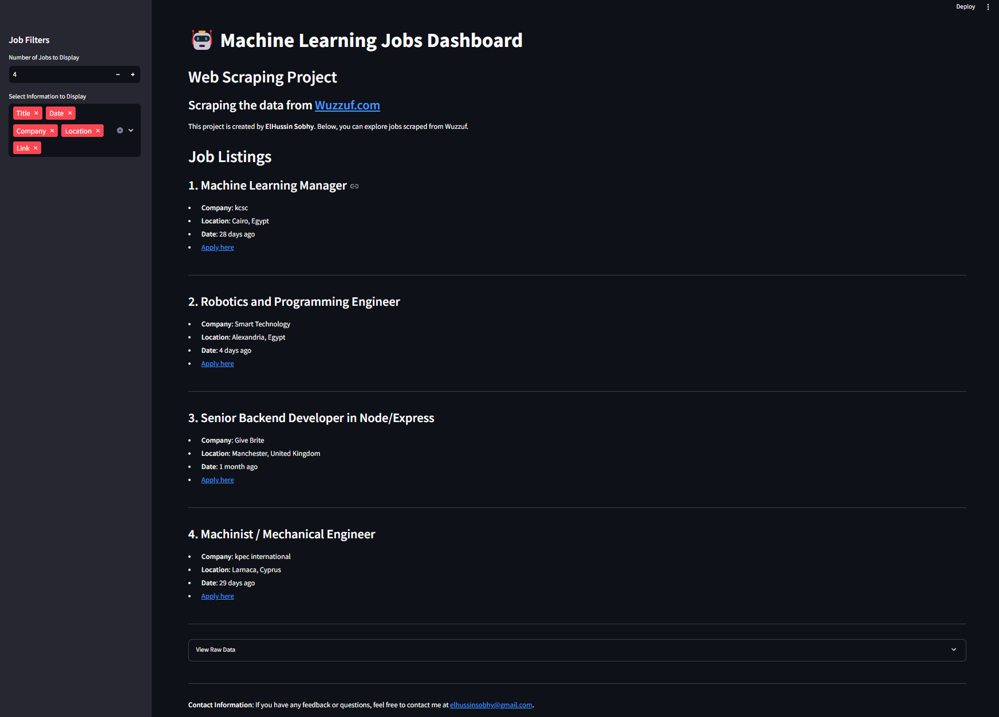

# **Machine Learning Jobs Dashboard**



## **Overview**

🤖 **Machine Learning Jobs @ Wuzzuf** is a Python-based project that scrapes job data from [Wuzzuf.com](https://wuzzuf.net/) and displays it in an interactive **Streamlit Dashboard**. The app allows users to explore job listings in the Machine Learning field, providing detailed information about companies, locations, skills, and more.

---

## **Features**

- **Web Scraping**: Scrapes job data dynamically from Wuzzuf.com using Python.
- **Interactive Dashboard**:
  - Filter jobs by the number of listings to display.
  - Select which attributes (e.g., title, location, skills) to show.
- **Clean Data Display**: Simplifies job information like skills, experience, and salaries for readability.
- **Direct Application Links**: Navigate directly to job postings.

---

## **Project Structure**

The project directory is organized as follows:

```plaintext
.
├── App.py                  # Main Streamlit dashboard script
├── jobs.csv                # The scraped job data file
├── requirements.txt        # Python dependencies for the project
├── assets/                 # Folder containing screenshots or media files
│   └── dashboard_screenshot.png  # Example screenshot of the dashboard
└── README.md               # Project documentation


---

